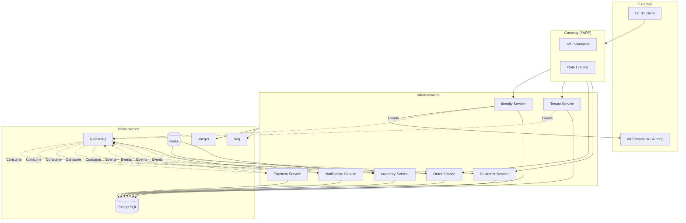

# SaaS Microservices Platform

## Prerequisites

- [.NET 8 SDK](https://dotnet.microsoft.com/download/dotnet/8.0)
- [Docker](https://docs.docker.com/get-docker/)
- Make (optional, for convenience targets)

## One-Command Setup

Start all local infrastructure:

```bash
make up
```

Or without Make:

```bash
docker compose up -d
```

## Infrastructure Services

| Service   | Port  | Description                      | URL                          |
|-----------|-------|----------------------------------|------------------------------|
| Postgres  | 5432  | PostgreSQL 16 (service DBs)      | `localhost:5432`             |
| RabbitMQ  | 5672  | AMQP broker                      | `localhost:5672`               |
| RabbitMQ  | 15672 | Management UI                    | http://localhost:15672         |
| Redis     | 6379  | Cache / distributed locks        | `localhost:6379`               |
| Jaeger    | 16686 | Distributed tracing UI           | http://localhost:16686         |
| Seq       | 5341  | Log ingestion / UI               | http://localhost:5341          |

## Architecture



> **Rules of the platform**
> - The Gateway is the **only** external ingress point.
> - Services communicate **asynchronously via events only** (no HTTP between services).
> - Every service owns its **own PostgreSQL database**.
> - The platform is a **resource server** — JWTs are issued by an external IdP.
> - All domain mutations use the **transactional outbox** pattern.

## Shared Libraries

- **SaaSCommon.Domain** — Base entity, domain events, strongly-typed IDs, Result monad, Error types.
- **SaaSCommon.Application** — MediatR pipeline behaviors: logging, validation, transaction.
- **SaaSCommon.Infrastructure** — MassTransit with outbox, OpenTelemetry, Polly resilience, EF Core tenant filter, current tenant service.

## Scripts

| Script | Purpose |
|--------|---------|
| `scripts/wait-for-infra.sh` | Wait for Postgres and RabbitMQ to be ready. |
| `scripts/init-databases.sh` | Create all service databases in the local Postgres instance. |
| `scripts/health-check.sh` | Check Postgres per-database, RabbitMQ queue health, and Redis connectivity. |
| `scripts/seed-data.sql` | Optional seed data for local development (tenants, users, stock items). |

## Configuration

### Environment Variables

Copy `.env.example` to `.env` and adjust values for your environment.

| Variable | Description | Example |
|----------|-------------|---------|
| `ConnectionStrings__Identity` | Postgres DB for Identity | `Host=localhost;Port=5432;Database=identity;...` |
| `ConnectionStrings__Tenant` | Postgres DB for Tenant | `Host=localhost;Port=5432;Database=tenant;...` |
| `ConnectionStrings__Order` | Postgres DB for Order | `Host=localhost;Port=5432;Database=order;...` |
| `ConnectionStrings__Payment` | Postgres DB for Payment | `Host=localhost;Port=5432;Database=payment;...` |
| `ConnectionStrings__Inventory` | Postgres DB for Inventory | `Host=localhost;Port=5432;Database=inventory;...` |
| `ConnectionStrings__Customer` | Postgres DB for Customer | `Host=localhost;Port=5432;Database=customer;...` |
| `ConnectionStrings__Notification` | Postgres DB for Notification | `Host=localhost;Port=5432;Database=notification;...` |
| `RabbitMq__Host` | AMQP broker URL | `amqp://localhost:5672` |
| `RabbitMq__Username` | AMQP username | `saas` |
| `RabbitMq__Password` | AMQP password | `saas` |
| `Jwt__Authority` | External IdP JWKS endpoint | `https://idp.example.com/.well-known/jwks.json` |
| `Otlp__Endpoint` | OpenTelemetry collector (gRPC) | `http://localhost:4317` |

### appsettings.Development.json

A reference template is provided at `config/appsettings.Development.json`. Each service should include this shape in its own `appsettings.Development.json` and override the `ConnectionStrings` key that matches its service name.

## Build

```bash
dotnet build
```

## Project Structure

```
.
├── config/                  # Shared configuration templates
├── deploy/                  # Kubernetes manifests (future phases)
├── scripts/                 # Local dev helper scripts
├── src/
│   └── Shared/
│       ├── SaaSCommon.Domain/
│       ├── SaaSCommon.Application/
│       └── SaaSCommon.Infrastructure/
├── tests/                   # Test projects (future phases)
├── docker-compose.yml
├── docker-compose.override.yml
├── .env.example
├── Directory.Build.props
├── Directory.Packages.props
├── global.json
└── SaaSPlatform.sln
```
